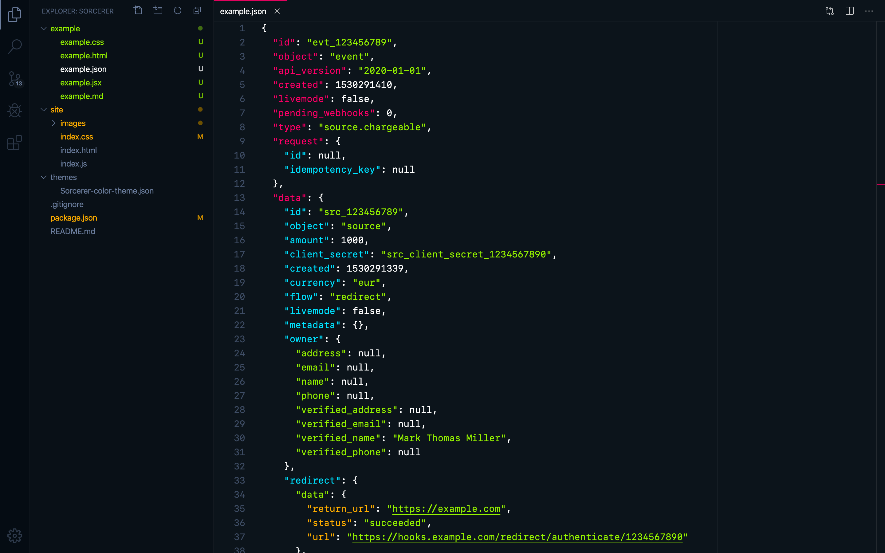
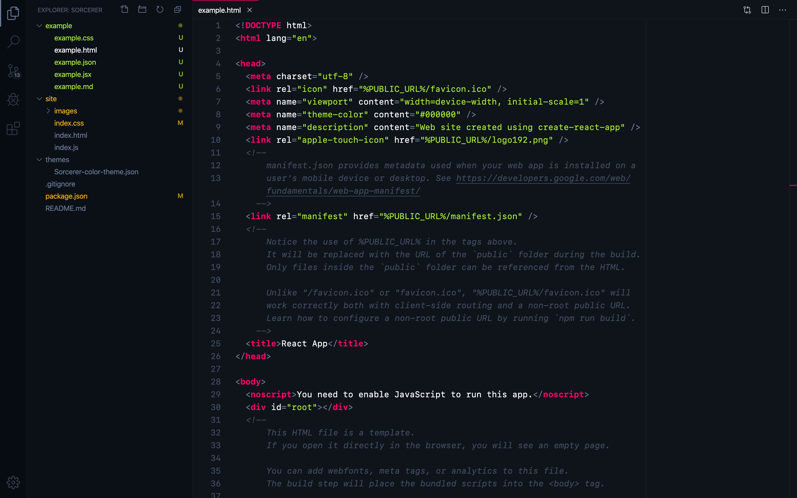
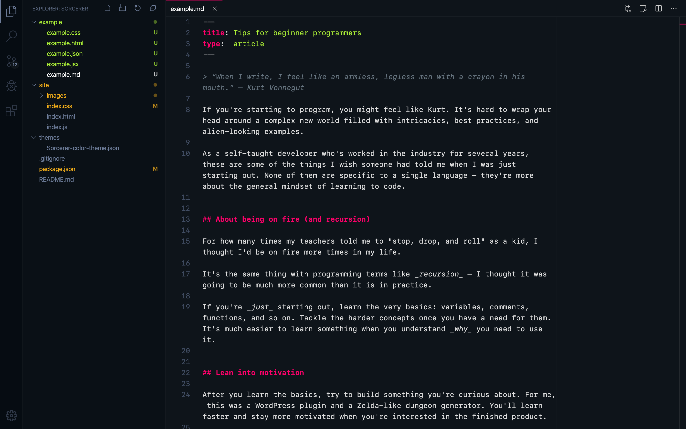

# Sorcerer: a vibrant dark theme for VS Code

[View homepage ⟶](https://sorcerer.mage.tools)

Sorcerer is a vibrant dark theme for VS Code inspired by [MageTools](https://mage.tools).

It uses the same palette of neon colors as MageTools. These colors were carefully chosen and inspired by cyberpunk art and vibrant dark themes like Monokai, Styrokai, and One Dark Pro.

- pink: `#ff006a`
- blue: `#44dfff`
- green: `#aaed36`
- yellow: `#f5af19`
- gray: `#6e7d9a`

Special care was given to the appearance of several languages which are popular in frontend development:

- JSX
- HTML
- CSS
- JSON
- Markdown

I'd love to expand Sorcerer beyond these languages. If you encounter any quirks or want to help out, I'd love for you to submit an issue or pull request at [github.com/markthomasmiller/sorcerer](https://github.com/markthomasmiller/sorcerer). This helps me stay organized and work to make the theme better for everyone.

Made by [Mark Thomas Miller](https://zeph.co) ([Twitter](https://twitter.com/mayvalemark)).