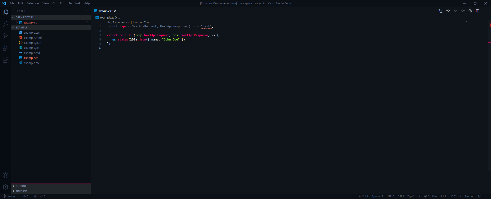

# Sorcerer: a vibrant dark theme for VS Code

[View homepage ⟶](https://sorcerer.mage.tools)

Sorcerer is a vibrant dark theme for VS Code that matches [MageTools](https://mage.tools?utm_source=sorcerer).

Sorcerer uses the [MageTools](https://mage.tools?utm_source=sorcerer) color palette. These colors are inspired by cyberpunk art, video game magic, and vibrant dark themes like Monokai, Styrokai, and One Dark Pro.

- pink: `#ff006a`
- blue: `#44dfff`
- green: `#aaed36`
- yellow: `#f5af19`
- gray: `#6e7d9a`
- dark blue: `#0e141a`

Special care was given to the appearance of several languages which are popular in frontend development: JSX, HTML, CSS, JSON, and Markdown.

I'd love to expand Sorcerer beyond these languages. If you encounter any quirks or want to help out, I'd love for you to submit an issue or pull request at [github.com/markthomasmiller/sorcerer](https://github.com/markthomasmiller/sorcerer). This helps me stay organized and work to make the theme better for everyone.

Author: [Mark Thomas Miller](https://mtm.dev) ([Twitter](https://twitter.com/mtmdev_))
