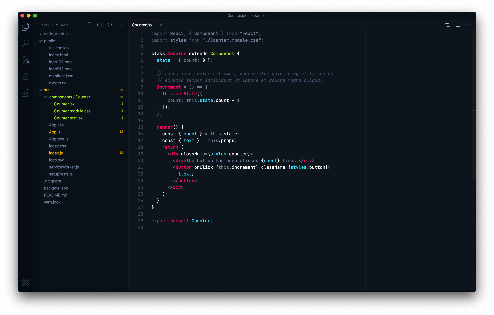

# Sorcerer: a vibrant dark theme for VS Code

Sorcerer is a vibrant dark theme for VS Code. It uses the same colors as [MageTools](https://mage.tools):

- Pink: `#ff006a`
- Blue: `#44dfff`
- Green: `#aaed36`
- Yellow: `#f5af19`
- Gray: `#6e7d9a`
- Dark Blue: `#0e141a`

Special care was given to the appearance of JS/JSX, HTML, CSS, JSON, and Markdown. See more images on Sorcerer's [homepage](https://sorcerer.mage.tools).

Made by [Mark Thomas Miller](https://zeph.co) ([Twitter](https://twitter.com/mayvalemark)).